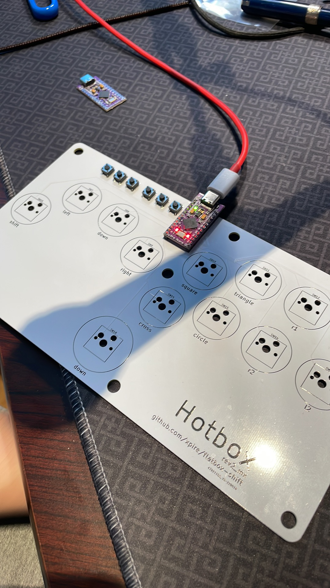

# Hotbox: Low profile hitbox-layout fightstick
## This is a fork of Flatbox, where the PCB was modified to have a shift along with the directional inputs, and use hotswappable fullsize MX key switches

This repository contains 3D-printable models, PCB design files and code needed to make an arcade controller that looks like this:

Look at the table for the difference between each revision.

Reddit post: https://www.reddit.com/r/fightsticks/comments/y1vh9n/my_custom_fight_stick_made_with_a_custom_pcb_7/

version | [rev1.1](hardware-rev1.1) | [rev2](hardware-rev2) | [rev3](hardware-rev3) | [rev4](hardware-rev4) | [shift](hardware-shift-rev2)
------- | ------------------------- | --------------------- | --------------------- | --------------------- | ----
case dimensions | 218x128x10mm | 218x130x10mm | 218x130x10mm | 218x130x10mm | 227.14x120x?mm
compatibility (using provided firmware) | PC, PS3 | PC, PS3 | PC, PS3, PS4 | PC, PS3 | PC, PS3
add-on board | Arduino Pro Micro | - | [Brook PS3/PS4](https://www.brookaccessory.com/detail/58690501/) | - | Arduino Pro Micro
onboard chip | - | ATmega32U4 | - | RP2040 | - 
port | micro USB | USB-C | USB-C | USB-C | USB-C (there are pro micros with usb c)
SMT assembly required | no | yes | yes | yes | no
firmware | [ATmega32U4](firmware-atmega32u4) | [ATmega32U4](firmware-atmega32u4) | [Brook](https://www.brookaccessory.com/download/PS3/) | [RP2040](firmware-rp2040) | [ATmega32U4](firmware-atmega32u4)
shift key | no | no | no | no | ***yes!***
key switches | low profile | low profile | low profile | low profile | ***normal MX***
hot swappable | yes | yes | yes | yes | yes
solder-able | yes | yes | yes | yes | no

# Process

## Design and Planning

First, we used Kicad to edit this existing PCB layout, adding an extra button for shift and swapping out the low profile gaterons for full sized MX hotswap.

We then designed acrylic layers to encase the PCB, and mocked it in blender to see if it would work out.

## Prototyping

We printed the boards with https://jlcpcb.com/

We soldered on the arduino, and tested that the inputs worked

Once we had verified the board worked, we 3D printed the layers to simulate what the final product would look like.

## Fabrication

We borrowed a friend's uncle's CNC machine, and started carving the design out of sheets of acrylic.

## Result

## Parts List
* arcade MX buttons - https://www.ebay.com/itm/165134564232 (url is now https://www.ebay.com/itm/155628299989)
* Chicago Screws - https://www.ebay.com/itm/0-67-034-to-0-87-034-17mm-to-22-mm-x-5mm-Stainless-steel-Knife-Handle-chicago-Screw-/231976520482?ssPageName=STRK:MESE:IT
* MX Switches
* Gateron hotswaps
* mini buttons
* Arduino pro micro with usb c
* Acrylic Layers (laser cut, or CNCed)

## Useful guides
- https://github.com/b1nc/Egg-On-Rice-Controller
- https://www.youtube.com/watch?v=ia2n7P3Csac
